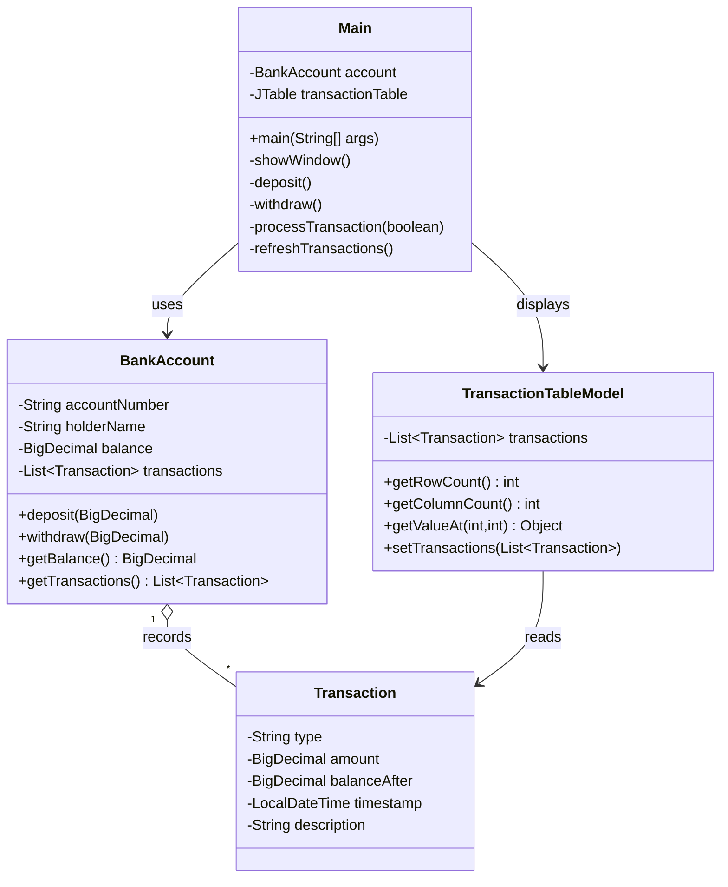

# Class Diagram

```mermaid
classDiagram
    class Main {
      -BankAccount account
      -JTable transactionTable
      +main(String[] args)
      -showWindow()
      -deposit()
      -withdraw()
      -processTransaction(boolean)
      -refreshTransactions()
    }
    class BankAccount {
      -String accountNumber
      -String holderName
      -BigDecimal balance
      -List~Transaction~ transactions
      +deposit(BigDecimal)
      +withdraw(BigDecimal)
      +getBalance() BigDecimal
      +getTransactions() List~Transaction~
    }
    class Transaction {
      -String type
      -BigDecimal amount
      -BigDecimal balanceAfter
      -LocalDateTime timestamp
      -String description
    }
    class TransactionTableModel {
      -List~Transaction~ transactions
      +getRowCount() int
      +getColumnCount() int
      +getValueAt(int,int) Object
      +setTransactions(List~Transaction~)
    }
    Main --> BankAccount : uses
    BankAccount "1" o-- "*" Transaction : records
    Main --> TransactionTableModel : displays
    TransactionTableModel --> Transaction : reads
```
